This is a companion GitHub page for the paper titled, "A Tutorial on the Use of Artificial Intelligence Tools for Facial Emotion Recognition in R". It primarily serves to include details about the tutorial that could not be included within the paper itself. That includes the sample video from the RAVDESS data set, which is featured in the paper, sample code for easy copy-and-paste, and other illustrative examples that may help with the installation and initialization of software. If any code or tutorial instructions are not working/up-to-date, feel free to let us know under the issues column. Thank you!

# Install py-feat

To use py-feat within R, we can use `reticulate`. The following code can be used to set it up.

```
## Install py-feat
library(reticulate)
install_python('3.8.10')
use_python_version('3.8.10')
virtualenv_create('r-py-feat', python='3.8.10')
virtualenv_install("r-py-feat","py-feat")


## test installation
use_virtualenv("r-py-feat")

feat <- import("feat")
detector <- feat$Detector()
res <- detector$detect_image("image_000001.jpg")
res
```

## Visualization the action units in py-feat
The following code is used to visualize the action units.

```{python}
!pip install scikit-learn==1.3.0
!pip install py-feat
!pip install matplotlib

import feat
detector = feat.Detector()
res = detector.detect_image("myimagefolder/image_000002.jpeg")
figs = res.plot_detections(faces="aus", muscles=True, add_titles=False)

import matplotlib.pyplot as plt
plt.show(figs)
```


# Use Google Cloud
To use Google and Amazon services, API keys are needed. The tutorials below show how to obtain the API keys.

## Enable the API

To use Google Cloud, we need to set up the API services. Here is a brief tutorial on how to do it based on enabling and using the Google Cloud Vision.

1. To start, to to Google Cloud console at [https://console.cloud.google.com/](https://console.cloud.google.com/)

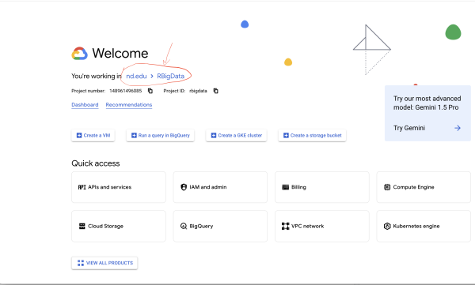

2. Click on nd.edu > first project or sth else there and in the popup window to create a new project.

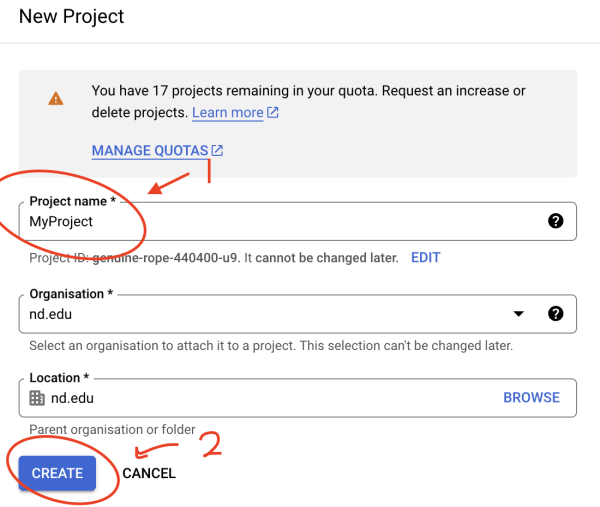

3. Select the newly created project and then click on "API and Services"

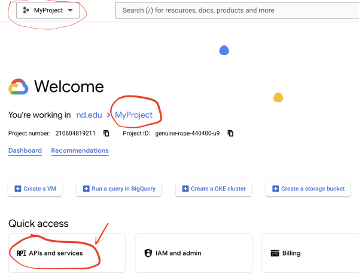

4. Then click on "+ENABLE APIS AND SERVICES"

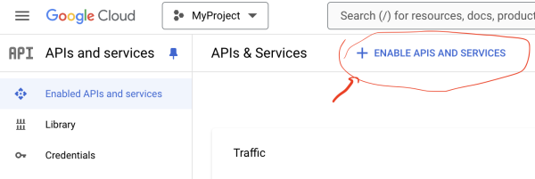

5. Select or search for "Cloud Vision API" and enable it.

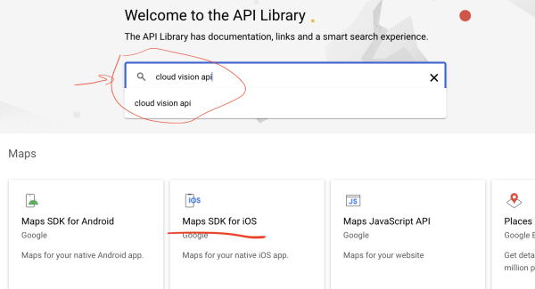
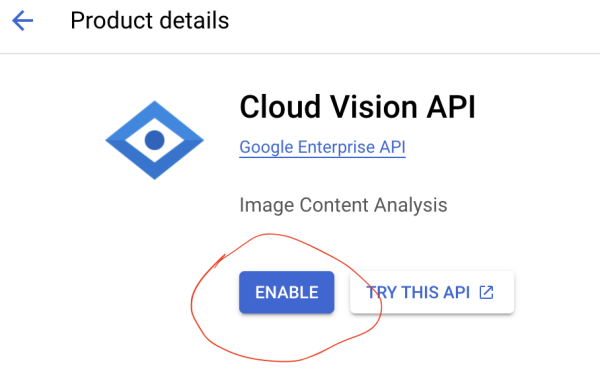

6. Click on "Create credentials"

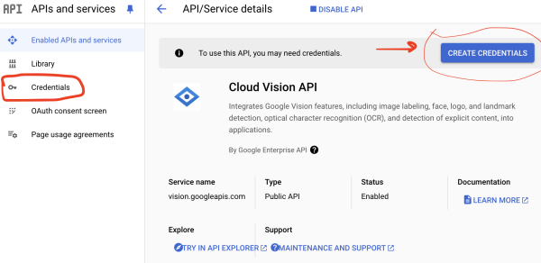

7. Now create the credentials following each step. 

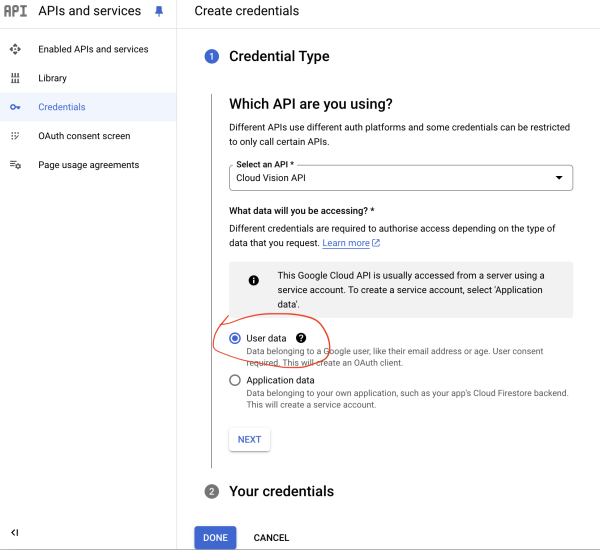
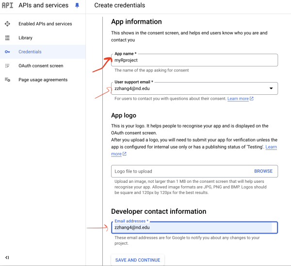

One can specify the scope of the APIs. Here we choose Cloud Vision.

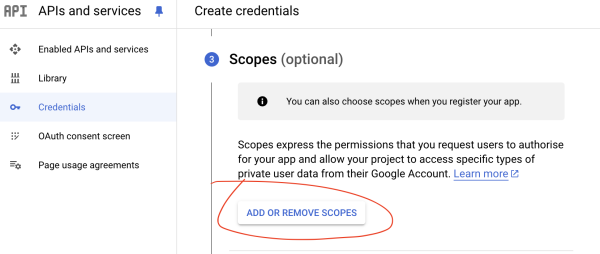
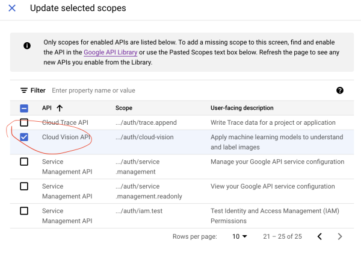

Now create the client ID

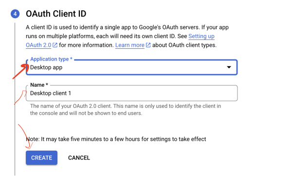

After it, you can download the ID as a JSON file.

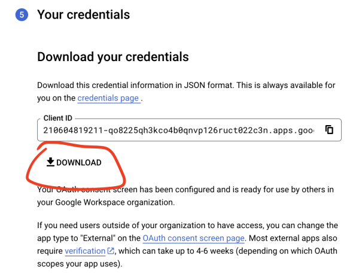

Click on "Done" to complete it.

## Authenticate within R

We now use the R package googleAuthR to authenticate to Google.

1. Load the library (you may need to install it first using `install.packages('googleAuthR')`
2. Specify the scopes to use
3. Set the client ID using `gar_set_client`. `file.choose()` allows you to choose the JSON file you saved earlier. 
4. Then for the use of the first time, use `gar_auth` to authenticate.

```
library(googleAuthR)

# specify the scopes - Google cloud and cloud vision for example.
scopes = c("https://www.googleapis.com/auth/cloud-vision",
           "https://www.googleapis.com/auth/cloud-platform")

# set the client
gar_set_client(file.choose(), scopes = scopes)

# authenticate and go through the OAuth2
gar_auth(email = "xxxx@nd.edu")
```

## Use the Cloud Vision service

```
library(googleCloudVisionR)
API.call <- gcv_get_image_annotations(imagePaths = "calm1.png", feature="FACE_DETECTION")
API.call
```

# Use Amazon Rekognition

To use the API, we need to get the API key. The following steps can be followed.

1. First, log in Amazon AWS through the link [https://aws.amazon.com](https://aws.amazon.com). If you don't have an account yet, please create one first.
2. After log in, go to IAM, e.g., by searching for it. 
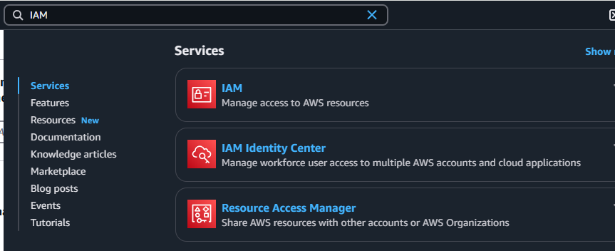
3. Click the link "Users" and then "Create user".
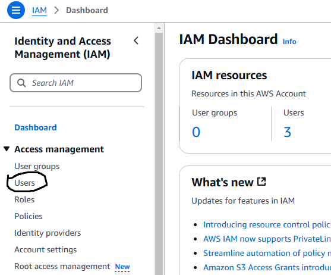
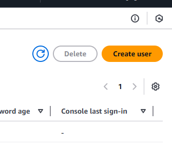
4. Create a name for the user 
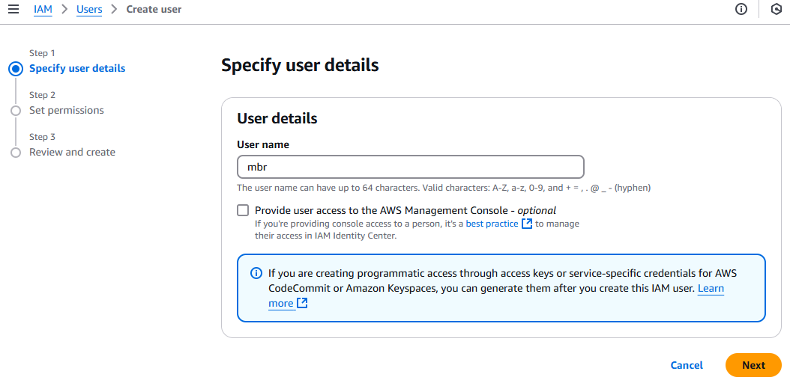
5. Choose the default settings and click on "Next" to create the user.  
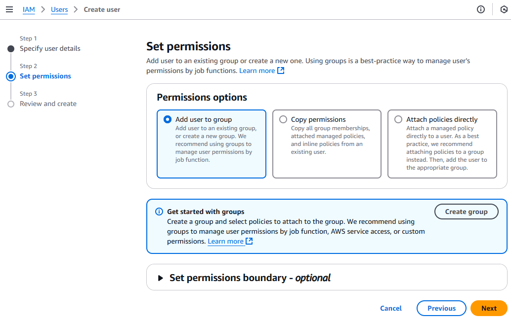
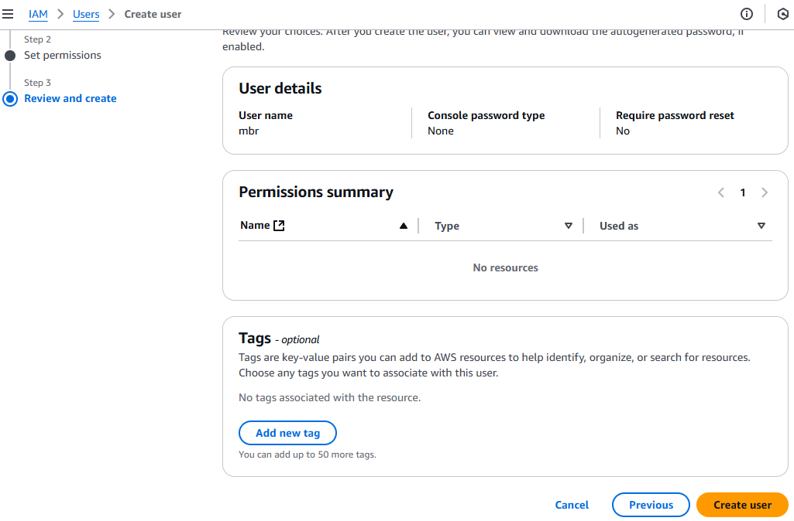
7. Click on the newly created user and then "Add permissions"  
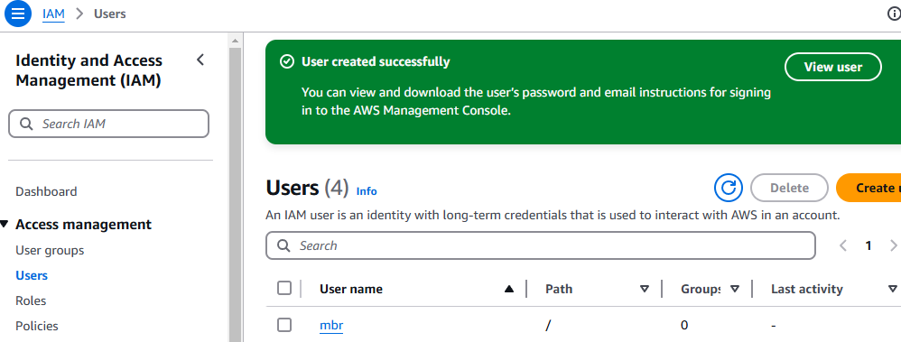
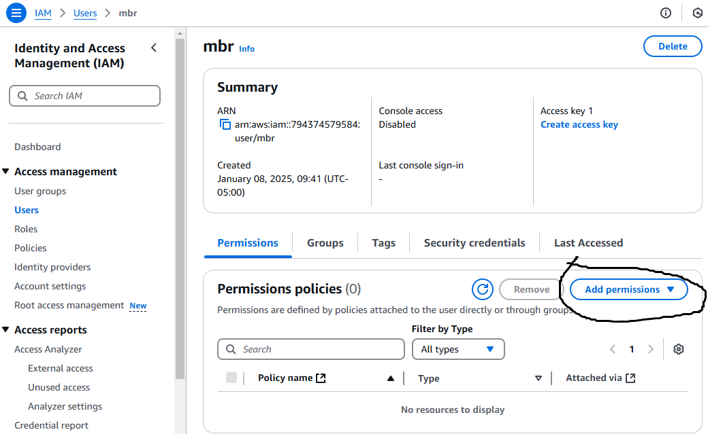
7. You choose "Attach policies directly" and then search for "Rekognition" and give full access.  
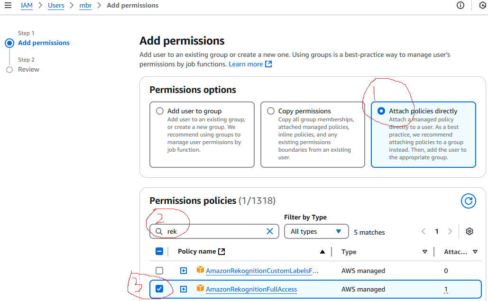
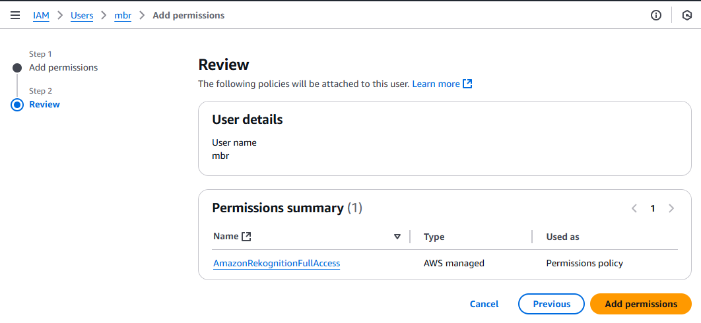
9. Then, we will "Create access key" for use with R.  
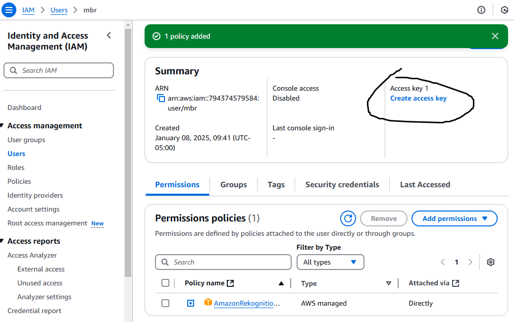
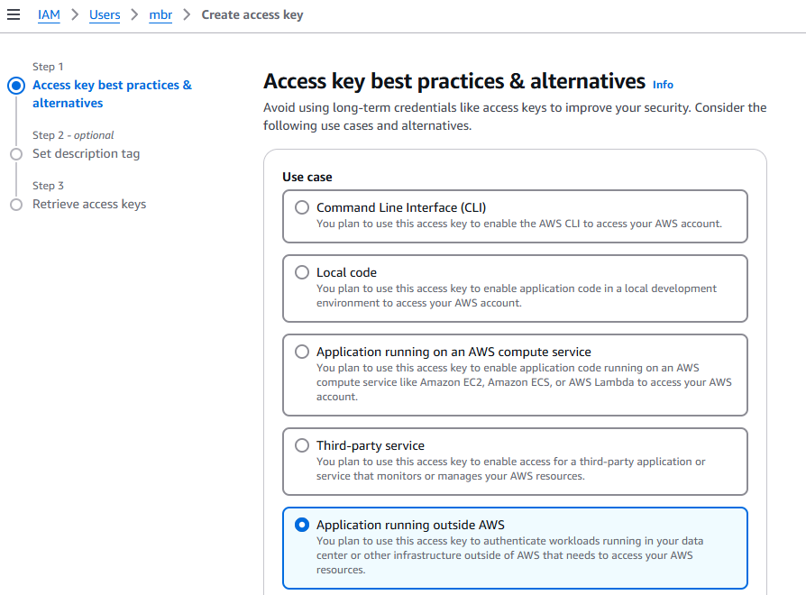
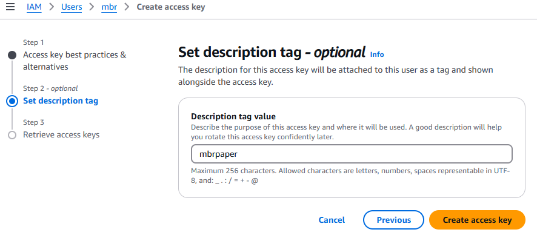
9. Finally, copy or download your access key. Save it in a safe place.  
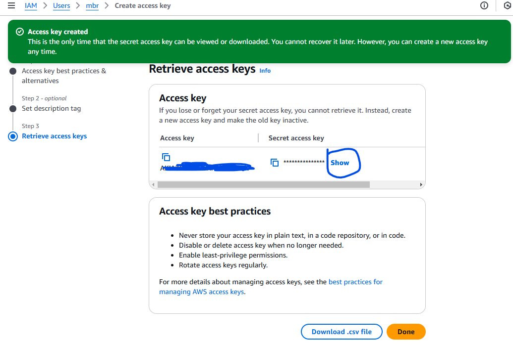

To use the key in R, use the code below:

```
library(paws)
library(paws.machine.learning)

Sys.setenv(
  AWS_ACCESS_KEY_ID = "you access key",
  AWS_SECRET_ACCESS_KEY = "your secrete access key",
  AWS_REGION = "us-east-1" ## change this to your AWS region
)
```


